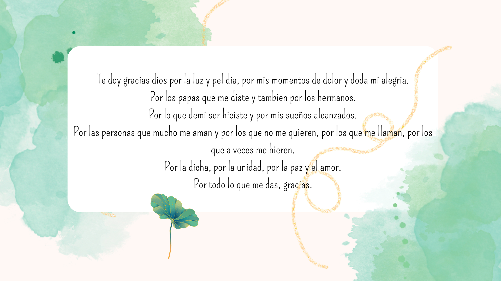
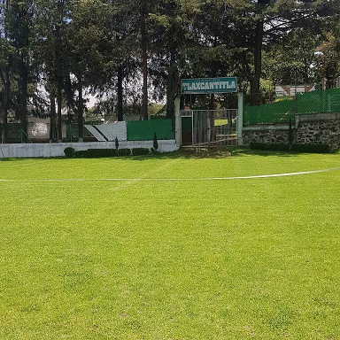
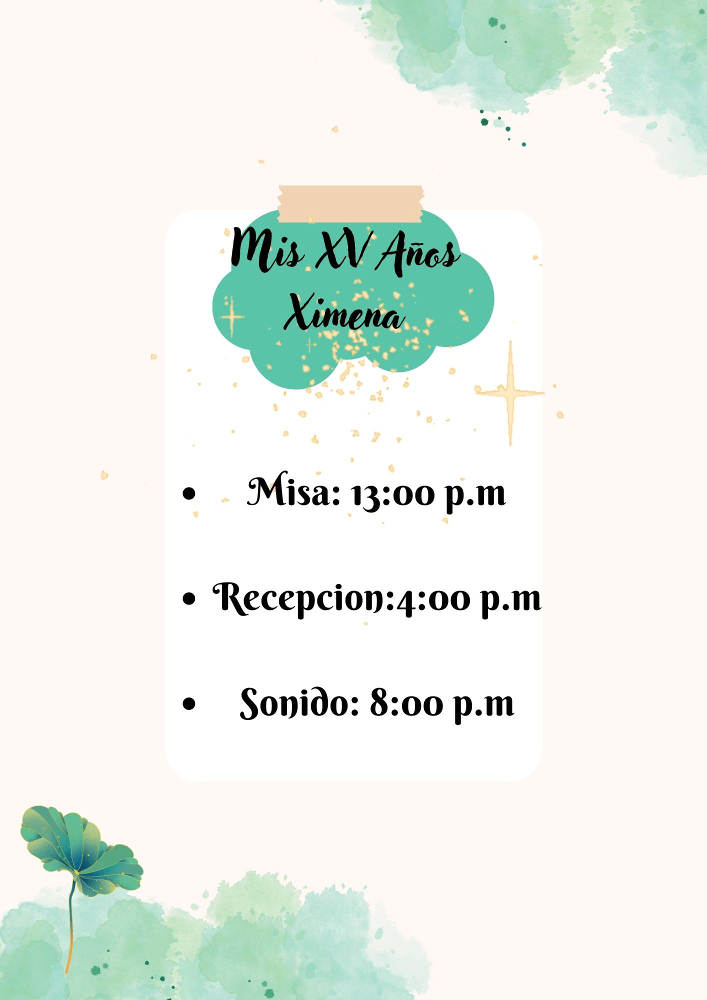

# brenda1815.github.io
<!DOCTYPE html>
<html lang="en">
<head>
 
    <link rel="preconnect" href="https://fonts.googleapis.com">
    <link rel="preconnect" href="https://fonts.gstatic.com" crossorigin>
    <link href="https://fonts.googleapis.com/css2?family=Combo&family=Comfortaa:wght@300&family=Dancing+Script&family=Great+Vibes&display=swap" rel="stylesheet">
    <meta charset="UTF-8">
    <link rel="stylesheet" type="text/css" href="estilo.css">
    <meta http-equiv="X-UA-Compatible" content="IE=edge">
    <meta name="viewport" content="width=device-width, user-scalable-no, initial-scale=1.0, maximum-scale=1.0, minimum-scale=1.0">
    <title>Ximena</title>
    
    

    
    

    <link href="https://cdn.jsdelivr.net/npm/bootstrap@5.3.0-alpha3/dist/css/bootstrap.min.css" rel="stylesheet" integrity="sha384-KK94CHFLLe+nY2dmCWGMq91rCGa5gtU4mk92HdvYe+M/SXH301p5ILy+dN9+nJOZ" crossorigin="anonymous">
    

    

    <link rel="stylesheet" href="https://cdnjs.cloudflare.com/ajax/libs/font-awesome/5.15.3/css/all.min.css">
    <link href="https://fonts.googleapis.com/css2?family=Russo+One&display=swap" rel="stylesheet">

<link rel="stylesheet" href="/invitaciones/css/trivia/bootstrap.min.css">

<link rel="stylesheet" href="/invitaciones/css/trivia/animate.min.css">

<link rel="stylesheet" href="/invitaciones/css/trivia/style.css">
<link rel="stylesheet" href="/invitaciones/css/trivia/estilos.css">

</head>

<body style="background-color:  #acd4b3;">
   
    <header>
             
        
            
    </header>        
     
    
    
        

        <!-- Contador regresivo -->
        <section>
       
    
    <table align="center" width="90%">
        <tr>
          <td></td>
          <td></th>
          <td></td>
          <td></td>
        </tr>
        <tr >
          <th>Días</th>
          <th>Horas</th>
          <th>Minutos</th>
         <th>Segundos</th>
        </tr>
    </table>
    
        </section> 
        <!-- Fin contador regresivo -->
    
        

</style>

<link href="/invitaciones/css/bootstrap.min.css" rel="stylesheet" type="text/css">

<link href="/invitaciones/font-awesome/css/font-awesome.min.css" rel="stylesheet" type="text/css">

<link href="/invitaciones/css/flexslider.css" rel="stylesheet" type="text/css">

<link href="/invitaciones/css/magnific-popup.css" rel="stylesheet" type="text/css">

<link href="/invitaciones/css/animate.css" rel="stylesheet" type="text/css">

<link href="/invitaciones/css/preloader.css" rel="stylesheet" type="text/css">

<link href="/invitaciones/css/owl.carousel.css" rel="stylesheet" type="text/css">

<link href="/invitaciones/css/style.css?IDA34Sb2322" rel="stylesheet" type="text/css">

<link rel="stylesheet" href="/invitaciones/css/theme6.css" type="text/css" media="screen" />
 

<section id="countdown" class="variables" style="background-color:#009D71">
    

    

    

        
    

    

    </section>
     
    
        

     

        

          

            
          

          

            
          

          

            
          

          

            
          

        

     

        <button class="carousel-control-prev" type="button" data-bs-target="#carouselExampleControls" data-bs-slide="prev">
          
          Previous
        </button>
        <button class="carousel-control-next" type="button" data-bs-target="#carouselExampleControls" data-bs-slide="next">
          
          Next
        </button>
     

                                

    <section style="background-color:   #acd4b3">
        <section id="wedding-header" class="wedding-header-single-page">
            

                

                    <h2 class="headline" style="color: #101010 ; font-family: 'Dancing Script'" >Dónde & Cuándo</h2>
                

            

        </section>
     

        

        

        
        

        

        <button type="button" class="close" data-dismiss="modal">&times;</button>
        <h4 class="modal-title">Ceremonia Religiosa</h4>
        

        

        

        
            <iframe class="mapa-pop" src="https://www.google.com/maps/embed?pb=!1m18!1m12!1m3!1d3764.4668684194207!2d-99.16490382587801!3d19.348927243349873!2m3!1f0!2f0!3f0!3m2!1i1024!2i768!4f13.1!3m3!1m2!1s0x85d1ffc331ae7955%3A0x3adba5441ccc1405!2sParroquia%20San%20Juan%20Bautista%20Coyoac%C3%A1n!5e0!3m2!1ses!2smx!4v1684377481174!5m2!1ses!2smx" 
            height="300" frameborder="0" style="border:0" allowfullscreen="">
            </iframe>
        

        <h3 class="wed-text" style="font-family: 'Comfortaa';">PARROQUIA DE SAN JUAN BAUTISTAS </h3>
        
Cuándo: 5 de Agosto de 2023 13:00 hrs. 

        
Dirección: Parque Centenario 8, Coyoacán, 04000 Ciudad de México, CDMX. 

        

        

        <button type="button" class="btn btn-secondary" data-dismiss="modal">Cerrar</button>
        

        

         

        

        

        

        
        

        

        <button type="button" class="close" data-dismiss="modal">&times;</button>
        <h4 class="modal-title">Recepción</h4>
        

        

        

        
            <iframe class="mapa-pop" src="https://www.google.com/maps/embed?pb=!1m18!1m12!1m3!1d3767.820297716902!2d-99.07500608509686!3d19.203049687015127!2m3!1f0!2f0!3f0!3m2!1i1024!2i768!4f13.1!3m3!1m2!1s0x85ce044c8e474685%3A0xe13f4e143a9b044b!2sJard%C3%ADn%20de%20Eventos%20TERRANOVA!5e0!3m2!1ses!2smx!4v1684810753598!5m2!1ses!2smx" 
             height="300" 
            style="border:0;" allowfullscreen="" ></iframe>
        

        <h3 class="wed-text">JARDIN DE EVENTOS TERRANOVA  </h3>
        
        
Cuándo: 5 de agosto de 2023 16:00 hrs. 

        
Dirección: Niños Heroes #91, San Bartolomé Xicomulco, Milpa Alta, 12250 San Bartolomé Xicomulco, CDMX.  

        

        

        <button type="button" class="btn btn-primary" data-dismiss="modal">Cerrar</button>
        

        

        

        

        
        

        

        
        

        

        <button type="button" class="close" data-dismiss="modal">&times;</button>
        <h4 class="modal-title">Itinerario</h4>
        

        

        

        
        

        <h3 class="wed-text"> </h3>
        
        

        

        

        

        
        <section id="wedding-info" >
            

            

            
            

            
            
          
                           <h3 style="font-family: 'Dancing Script'; text-align: center;">Ceremonia Religiosa </h3> 
                                    
                                    
                            <h3 class="text-center" style="font-family: 'Combo';">PARROQUIA DE SAN JUAN BAUTISTA</h3>        
                        

                            <b>Cuándo: </b> 5 de Agosto de 2023 13:00 hrs. 

                        

                            <b>Dirección:</b> Parque Centenario 8, Coyoacán, 04000 Ciudad de México, CDMX. 
                        

                         
                        
Ver ubicacion

                        
                        

                    

                     
                    

                        

                                <h3 style="font-family: 'Dancing Script'; text-align: center;">Recepción </h3>
                                 
                            
                                <h3 class="wed-text" style="font-family: 'Combo'; text-align: center;">JARDIN DE EVENTOS TERRANOVA</h3>
                            

                                <b>Cuándo: </b> 5 de Agosto  
                            

                            

                                <b>Dirección:</b> Niños Heroes #91, San Bartolomé Xicomulco, Milpa Alta, 12250 San Bartolomé Xicomulco, CDMX.                                . 
                            

                            
Ver ubicacion

                       
                        

                    
    

                        
                        

                            

                                <h3 style="font-family: 'Dancing Script'; text-align: center;"> Itinerario </h3>
                                
                                
                                <h3 class="wed-text"> </h3>
                            

                        

                

            

        
    </section>
    
    

    <section id="bridsmaid-groosman-header" class="onepage">
    

    
    

    
     
    <h2 class="headline" style="font-family: Dancing Script;">Mis Personas Favoritas</h2>
    

    
    

    </section>
    
    

    ¡Gracias por hacer esto posible!
    

    
    <section id="bridsmaid-groosman-content" class="onepage">
    

    

    
    

    
    

    
    
    

    
    <h3 style="font-family: Great Vibes">
Karina Hernández García
</h3>
    
- Mi Mamá -

    

    
    

    
    

    
    
    

    
    

    
    

    
    <h3 style="font-family: Great Vibes">
Margarita García Silva 
</h3>
    
- Mi Abuelita -

    

    
    

    
    

    
    

    
        

        
        

        
        <h3 style="font-family: Great Vibes">
Gustavo Urbina Hernandez 
</h3>
        
- Mi hermano -

        

        
        

        
        

    
    

    
    

    
    

    
    <h3 style="font-family: Great Vibes">
Sonia Naranjo Cortés  Ricardo Hernández García 
</h3>
    
- Mis Padrinos -

    

    

    

    

    

    

    </section>
        
    

     
    
    <footer id="footer" class="footer-background-cover screen-adapter">
         

        

        
        

        
            
            <h2 style="font-family: Dancing Script;" class="text-center"><strong>Los momentos especiales son para compartirlos.</strong></h2>
            <h2 style="font-family: Dancing Script;" class="text-center"><strong>¡Ven a mi fiesta y celebremos juntos!</strong></h2>
            <h2 style="font-family: Dancing Script;" class="text-center"><strong>Los esperamos.</strong></h2>
            

       
        
        

        
        

        

        </footer>
    

    

        

        <i class="fa fa-volume-up flotante" id="iconoMusica"></i>
        

        

            <i class="fa fa-volume-up flotante" id="iconoMusica"></i>
            

            
        

        
        

        <audio id="musica" loop>
        <source src="Sad Girl" type="audio/mp3">
        </audio>
        
        

        

        

        <h3 style="font-family: 'Dancing Script';">Bienvenidos a la invitación de Ximena</h3>
        
        
 <button class="btn btn-primary w-50 rounded-pill b1 text-transform">INGRESAR</button> 

        

        

        

            

</body>
</html>
